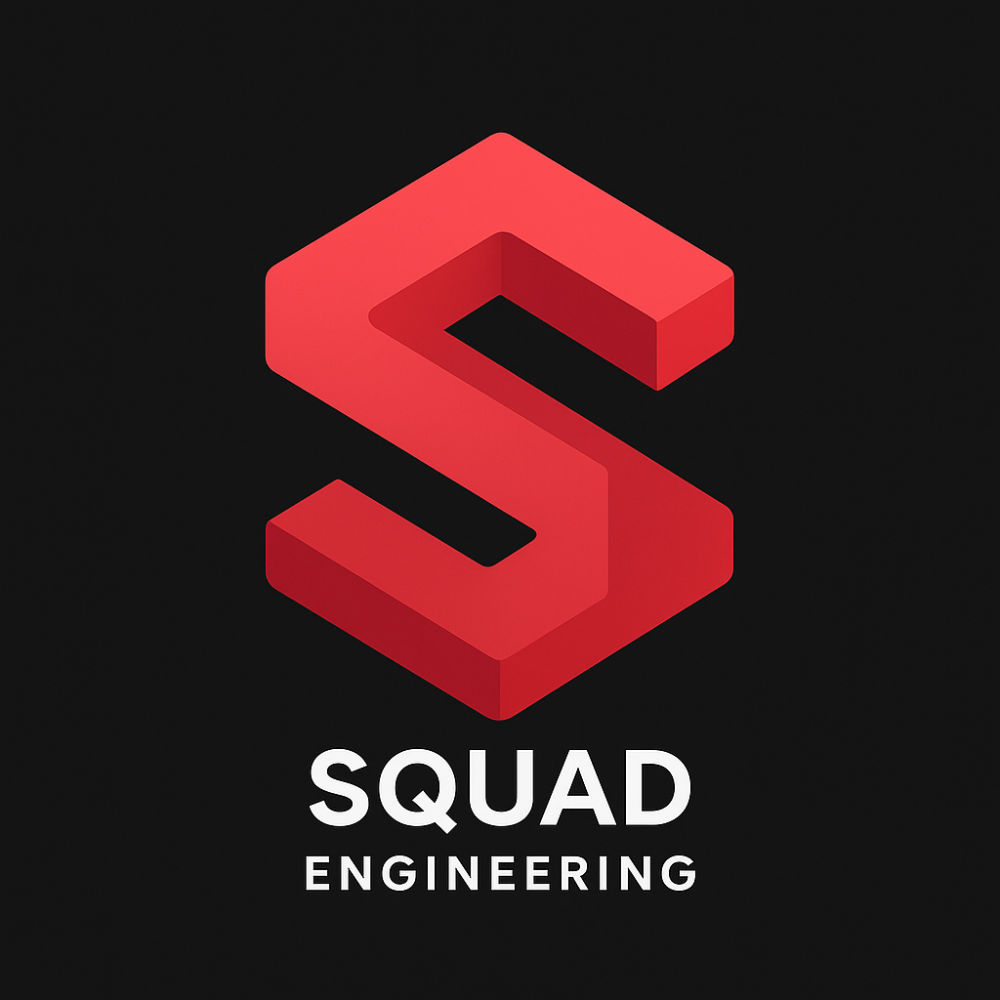
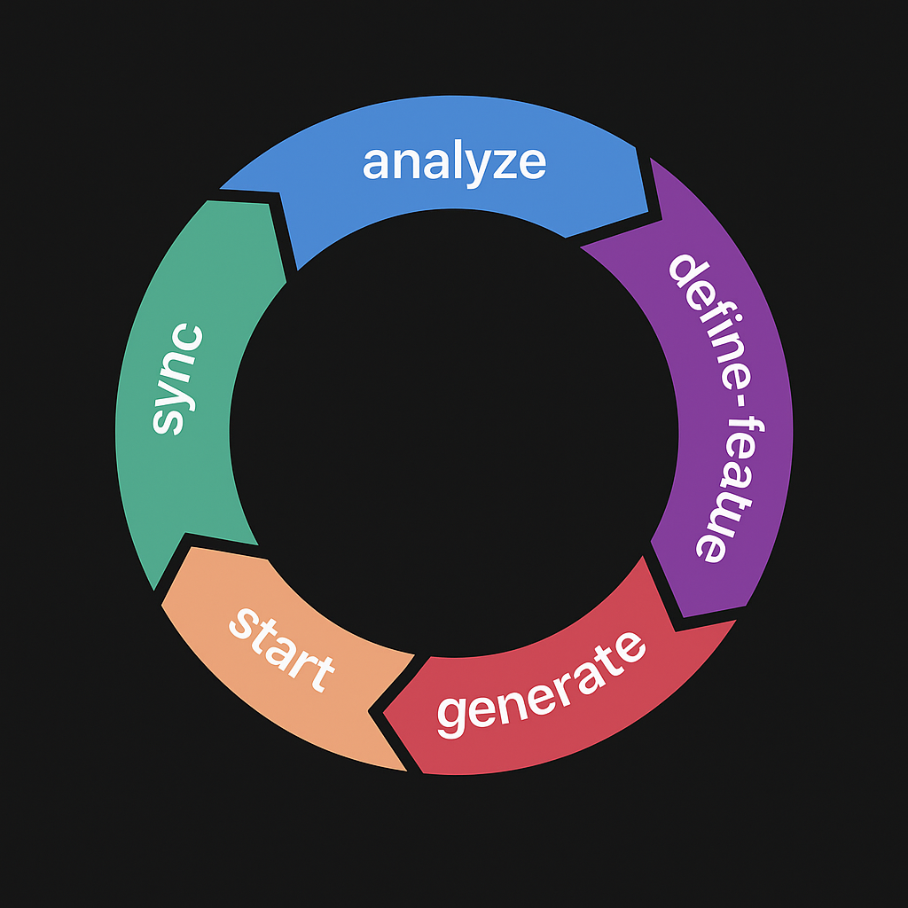

<div align="center">
  
  
  # 🧠 Squad Engineering
</div>

A pragmatic, agentic engineering framework built for [Claude Code](https://docs.anthropic.com/en/docs/claude-code/overview), inspired by how real software squads function.

Each LLM agent behaves like a human teammate: roles are defined, responsibilities split, communication is structured, and everything is executed through dedicated Claude Code terminals using rich, composable custom commands.

---

## 🚧 Thesis

**Squad Engineering** transforms LLM workstreams into persistent, asynchronous engineering teams that mirror real-world software development squads.

### Core Concept

Just like real engineering teams, Squad Engineering establishes a **persistent squad** of specialized agents that work together across multiple features and projects. The key insight is that you don't hire a new team for every feature - you have a stable team and allocate work to them.

### Squad Structure

* **Supervisor (Claude Opus)**: The engineering manager who never writes code. Allocates tasks, inspects progress, evaluates quality, and coordinates the team. Uses rules + MCP for oversight.
* **Role Agents (Claude Sonnet)**: The engineers - persistent team members with specific specializations (frontend, backend, QA, etc.) who execute tasks in isolation or parallel.
* **Commands**: The workflow system that manages task allocation, progress tracking, and team coordination - simulating the rituals of high-performing engineering teams.

### Key Principles

1. **Persistent Squad**: Agents are created once and reused across features
2. **Task Allocation**: Each feature gets tasks distributed to existing squad members
3. **Clear Boundaries**: Each agent has defined responsibilities and can't overstep
4. **Async Communication**: Agents communicate through structured logs, like remote teams
5. **Token Efficiency**: Limited context per agent reduces token usage and improves focus

### Why This Works

* **Separation of Concerns**: Each agent focuses only on their domain
* **Parallel Execution**: Multiple agents can work simultaneously in separate terminals
* **Realistic Workflows**: Mirrors proven human team structures and practices
* **Scalable Output**: Can handle complex features by distributing work effectively
* **Quality Control**: Supervisor ensures standards without getting into implementation

The framework treats LLMs not as a single omniscient coder, but as a team of specialists who need coordination, clear communication, and defined responsibilities to deliver software effectively.

---

## 🚀 Quick Start

### Initial Squad Setup (One-time)

1. **Clone the repository**
   ```bash
   git clone https://github.com/yourusername/squad-engineering.git
   cd squad-engineering
   ```

2. **Install Claude Code** (if not already installed)
   ```bash
   npm install -g @anthropic-ai/claude-code
   ```

3. **Analyze your project needs**
   ```bash
   claude /analyze
   ```

4. **Generate your persistent squad**
   ```bash
   # Create your engineering team - do this ONCE
   claude /generate-squad-role frontend-dev 2
   claude /generate-squad-role backend-dev 1
   claude /generate-squad-role qa-engineer 1
   ```

### Working on Features (Repeatable)

5. **Define a new feature**
   ```bash
   claude /define-feature authentication-system
   ```

6. **Allocate tasks to your squad**
   ```bash
   claude /allocate-tasks authentication-system
   ```

7. **Squad members start work**
   ```bash
   # In separate terminals for each active agent
   claude /start-task 1  # Frontend Dev 1
   claude /start-task 2  # Frontend Dev 2
   claude /start-task 3  # Backend Dev
   ```

8. **Monitor and sync progress**
   ```bash
   claude /sync-up
   ```

---

## 🔄 Workflow Overview

### One-Time Squad Setup
1. **`/analyze`** – Review project state and determine squad needs
2. **`/generate-squad-role`** – Create persistent squad members with specializations

### Feature Development Loop
For each new feature:

1. **`/define-feature`** – Create a comprehensive PRD for the feature
2. **`/allocate-tasks`** – Distribute feature work to existing squad members  
3. **`/start-task`** – Squad members begin executing their assigned tasks
4. **`/sync-up`** – Supervisor monitors progress and coordinates the team
5. **`/evaluate`** – Assess completion, quality, and readiness

Repeat steps 3–5 until the feature is delivered and evaluated.

### Key Insight
Your squad persists across features - you're not creating new agents each time, just giving your existing team new work. This mirrors how real engineering teams operate.

---

## 🧭 Workflow Diagram

<div align="center">
  
</div>

```mermaid
flowchart TD
  subgraph "One-Time Squad Setup"
    A[🔍 /analyze<br>Project assessment] --> B[🛠 /generate-squad-role<br>Create persistent squad]
  end
  
  subgraph "Per-Feature Loop"
    C[📄 /define-feature<br>Create structured PRD] --> D[📋 /allocate-tasks<br>Distribute work to squad]
    D --> E[🚧 /start-task<br>Squad members execute]
    E --> F[🔁 /sync-up<br>Progress coordination]
    F --> G[🧪 /evaluate<br>Quality review]
    G --> H{Feature Complete?}
    H -->|No| F
    H -->|Yes| I[✅ Ship Feature]
    I --> C
  end
  
  B --> C

  subgraph Environment
    S1[Supervisor (Claude Opus)]
    S2[Persistent Squad Agents (Claude Sonnet)]
    S3[Each agent in separate terminal]
    S4[MCP for evaluation & inspection]
  end
```

This diagram shows:

* **Initial Setup**: Squad is created once through analyze → generate-squad-role
* **Feature Loop**: Each feature follows define → allocate → execute → sync → evaluate
* **Persistence**: The same squad members work on multiple features
* **Parallel Execution**: Squad members work simultaneously in separate terminals

All interactions are mediated via markdown files and scoped Claude terminals.

---

## 📂 Directory Structure

```
.claude/
├── commands/              # Custom Claude Code commands
│   ├── analyze.md
│   ├── define-feature.md
│   ├── evaluate.md  
│   ├── generate-squad-role.md
│   ├── allocate-tasks.md
│   ├── start-task.md
│   ├── continue-task.md
│   └── sync-up.md
.squad/                    # Squad engineering workspace (partially gitignored)
├── supervisor-rules.md    # Supervisor behavior rules
├── squad-roster.md        # List of squad members and roles
├── templates/             # Reusable templates
│   ├── role-plan-template.md
│   └── role-comm-template.md
├── examples/              # Boilerplate examples
│   ├── frontend-boilerplate/
│   └── backend-boilerplate/
├── role-plan-<i>.md       # Current feature task assignments (gitignored)
├── role-comm-<i>.md       # Active communication logs (gitignored)
└── features/              # Feature PRDs (gitignored)
    └── feature-<name>.md
```

**Note**: The `.squad/` directory contains both persistent configuration (roster, templates, examples) and per-feature work files (role-plan-*, role-comm-*, features/). Work files are gitignored and reset per feature.

---

## 🎯 Core Commands

### Squad Setup Commands (One-time)

#### `/analyze`
Reviews the current project state and suggests optimal squad structure. Use this before creating your squad.

#### `/generate-squad-role <role> <count>`
Creates persistent squad members with specific specializations. Run once to establish your team.

### Feature Development Commands (Per-feature)

#### `/define-feature <name>`
Creates a comprehensive Product Requirements Document (PRD) for a new feature.

#### `/allocate-tasks <feature-name>`
Distributes work from the feature PRD to existing squad members, creating task plans for the current feature.

#### `/start-task <role-number>`
Squad member begins work on their assigned tasks for the current feature.

#### `/continue-task <role-number>`
Squad member resumes work on in-progress tasks.

#### `/sync-up`
Supervisor reviews all squad progress and coordinates the team.

#### `/evaluate`
Supervisor assesses work quality and feature completion.

---

## ✅ Best Practices

* 👥 **Persistent Squad**: Set up your squad once and reuse across all features
* 🧱 **Start from strong boilerplate** (`/examples`) to save tokens and enforce conventions
* 🧠 **Supervisor never writes code** — only plans, allocates, evaluates
* 📌 **Reset comm files per feature** but maintain squad structure
* ⛔️ **Don't bleed context**: each agent reads only their plan + comm
* 📎 **MCP integrations encouraged** for inspection, review, or CI
* 🔁 **Feature loop**: `define-feature → allocate-tasks → start → sync → evaluate`
* 🎯 **Clear task boundaries**: Each agent gets specific, measurable work items

---

## 🔧 Advanced Usage

### Running Multiple Agents
```bash
# Terminal 1: Frontend Developer
claude /start-task 1

# Terminal 2: Backend Developer
claude /start-task 2

# Terminal 3: Supervisor monitoring
claude /sync-up
```

### Custom Role Types
Create specialized roles by extending templates:
```bash
claude /generate-squad-role security-auditor 1
claude /generate-squad-role performance-engineer 1
```

### Feature Handoffs
When an agent completes their portion:
```bash
claude /continue-task 1  # Pick up where agent left off
```

---

## 🤝 Contributing

See [CONTRIBUTING.md](CONTRIBUTING.md) for guidelines on:
- Creating new command types
- Extending role templates
- Improving squad communication protocols
- Adding example implementations

---

## 📚 Learn More

- [Claude Code Documentation](https://docs.anthropic.com/en/docs/claude-code/overview)
- [Context Engineering Introduction](https://github.com/coleam00/context-engineering-intro)
- [Model Context Protocol (MCP)](https://docs.anthropic.com/en/docs/mcp)

---

## 📌 Coming Soon

* `/handoff` – Agent-to-agent context transition
* `/review` – Supervisor-led structured code review
* `/mirror-human-teams` – Spawn squads from real team archetypes

---

## 📄 License

MIT License - See [LICENSE](LICENSE) file for details.